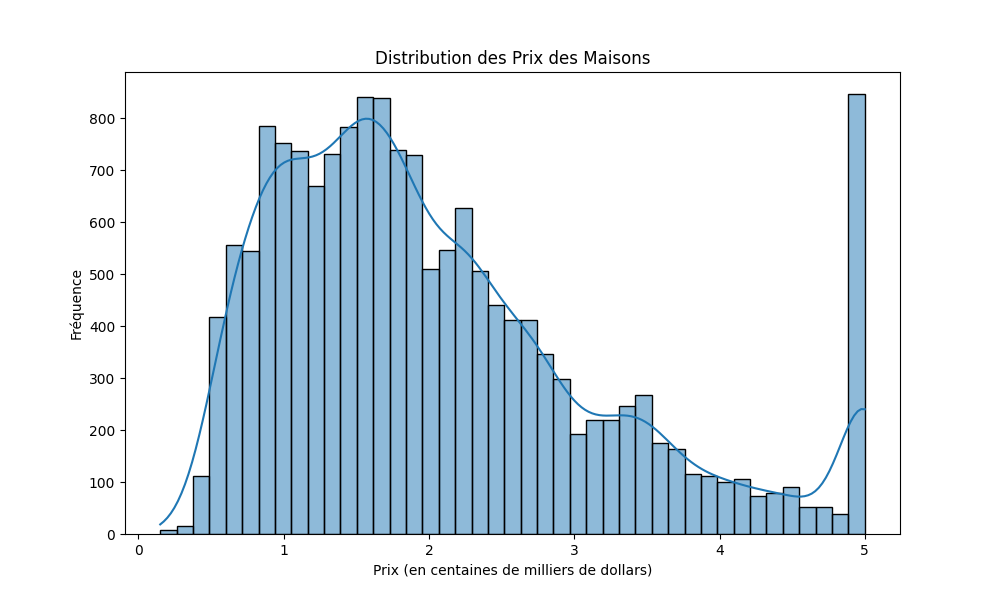
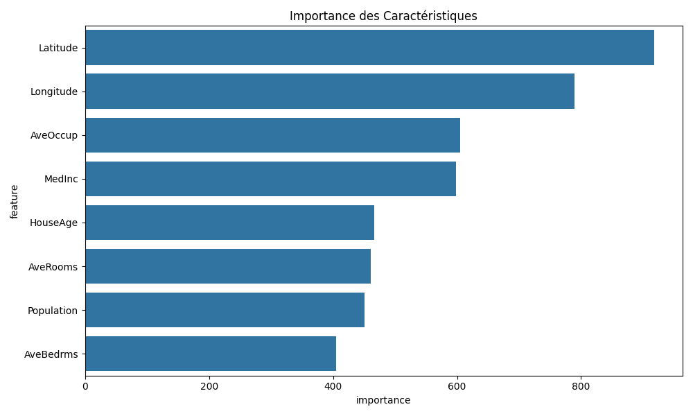
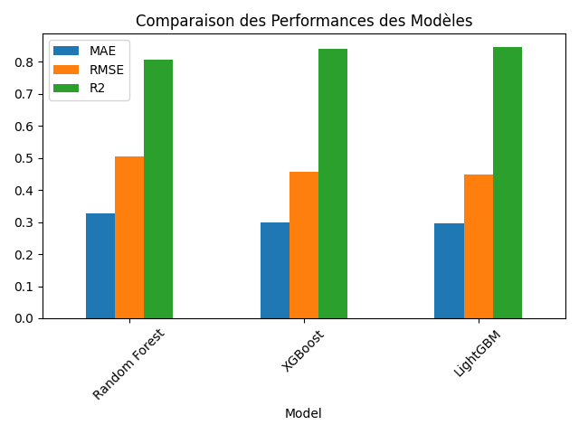
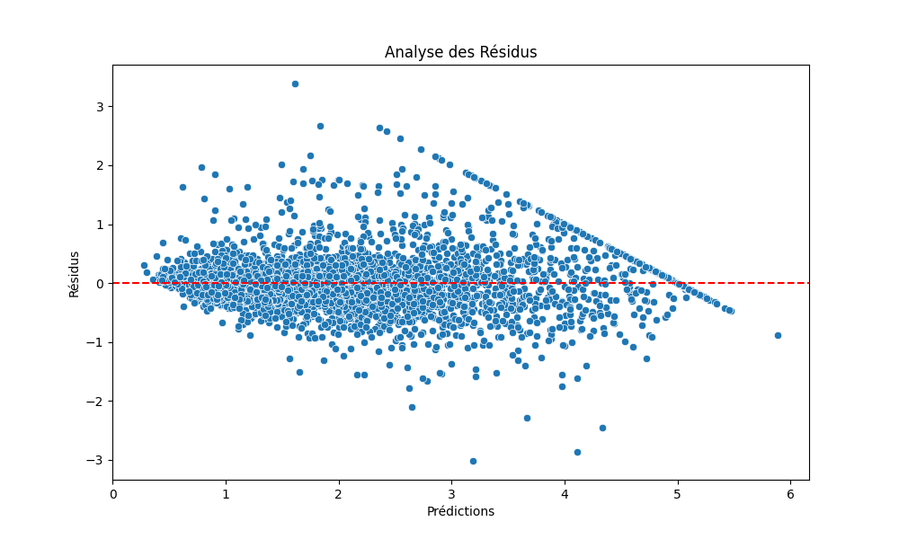

# Projet de Prédiction des Prix des Logements en Californie


Ce projet utilise l'apprentissage automatique pour prédire les prix des logements en Californie en se basant sur diverses caractéristiques telles que la surface habitable, le nombre de chambres, la localisation, etc.

## 📋 Table des matières
- [Aperçu](#aperçu)
- [Structure du Projet](#structure-du-projet)
- [Installation](#installation)
- [Utilisation](#utilisation)
- [Modèles](#modèles)
- [Résultats](#résultats)
- [Technologies Utilisées](#technologies-utilisées)
- [Contribution](#contribution)
- [Licence](#licence)

## Aperçu

Ce projet vise à prédire les prix des logements en Californie en utilisant différentes techniques d'apprentissage automatique. Il comprend :
- Une exploration approfondie des données
- Un prétraitement des données
- L'entraînement de plusieurs modèles (Régression Linéaire, Random Forest, XGBoost, LightGBM)
- Une optimisation des hyperparamètres
- Une interface utilisateur interactive avec Streamlit

### Interface Utilisateur


### Visualisation des Données



## Structure du Projet

```
ML Prediction Project/
├── app/
│   └── app.py              # Application Streamlit
├── data/
│   ├── housing.csv         # Données brutes
│   ├── X_train.csv         # Données d'entraînement
│   ├── X_test.csv          # Données de test
│   ├── y_train.csv         # Labels d'entraînement
│   └── y_test.csv          # Labels de test
├── models/
│   ├── random_forest.joblib
│   ├── xgboost.joblib
│   ├── lightgbm.joblib
│   └── optimized_lightgbm.joblib
├── src/
│   ├── exploration.py      # Exploration des données
│   ├── preprocessing.py    # Prétraitement des données
│   ├── train.py           # Entraînement des modèles
│   ├── optimize.py        # Optimisation des hyperparamètres
│   └── evaluate_optimized.py # Évaluation des modèles optimisés
├── images/                 # Images et visualisations
│   ├── app_interface.png
│   ├── prediction_interface.png
│   ├── price_distribution.png
│   └── feature_importance.png
├── requirements.txt        # Dépendances
└── README.md              # Documentation
```

## Installation

1. Clonez le dépôt :
```bash
git clone https://github.com/votre-username/ML-Prediction-Project.git
cd ML-Prediction-Project
```

2. Créez un environnement virtuel et activez-le :
```bash
python -m venv venv
source venv/bin/activate  # Sur Windows : venv\Scripts\activate
```

3. Installez les dépendances :
```bash
pip install -r requirements.txt
```

## Utilisation

1. Exploration des données :
```bash
python src/exploration.py
```

2. Prétraitement des données :
```bash
python src/preprocessing.py
```

3. Entraînement des modèles :
```bash
python src/train.py
```

4. Optimisation des modèles :
```bash
python src/optimize.py
```

5. Lancement de l'application Streamlit :
```bash
streamlit run app/app.py
```

## Modèles

Le projet utilise quatre modèles différents :
1. Régression Linéaire
2. Random Forest
3. XGBoost
4. LightGBM

Les performances des modèles optimisés sont les suivantes :

| Modèle | MAE | RMSE | R² Score |
|--------|-----|------|----------|
| Random Forest | 0.3268 | 0.5038 | 0.8063 |
| XGBoost | 0.2997 | 0.4582 | 0.8398 |
| LightGBM | 0.2952 | 0.4490 | 0.8461 |

### Comparaison des Performances


## Résultats

Le modèle LightGBM optimisé a obtenu les meilleures performances avec :
- Un score R² de 0.8461
- Une erreur absolue moyenne (MAE) de 0.2952
- Une racine carrée de l'erreur quadratique moyenne (RMSE) de 0.4490

### Visualisation des Résidus


## Technologies Utilisées

- Python 3.9
- Pandas
- NumPy
- Scikit-learn
- XGBoost
- LightGBM
- Streamlit
- Matplotlib
- Seaborn

## Contribution

Les contributions sont les bienvenues ! Voici comment contribuer :

1. Fork le projet
2. Créez une branche pour votre fonctionnalité (`git checkout -b feature/AmazingFeature`)
3. Committez vos changements (`git commit -m 'Add some AmazingFeature'`)
4. Poussez vers la branche (`git push origin feature/AmazingFeature`)
5. Ouvrez une Pull Request

## Licence

Ce projet est sous licence MIT. Voir le fichier `LICENSE` pour plus de détails. 